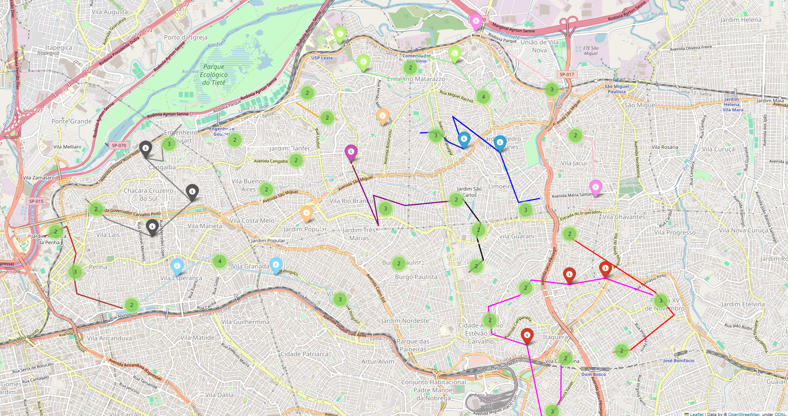

# Python Delivery Optimizer

Welcome to Python Delivery Optimizer! 🚀 This project was created to make managing your delivery routes easier and more efficient. Whether you are a logistics guru or just starting out, this code will help you get started with your future system.


## Features

- **Location Data Handling**:  Processes and formats location data in Well-Known Text (WKT) format.
- **Delivery Optimization**: Assigns delivery tasks to personnel based on their capacity and geographical constraints.
- **Geospatial Analysis**: Utilizes the Haversine formula to calculate distances between locations.
- **Mapping**: Creates visual maps to represent optimized delivery routes using Folium.

## Getting Started

### Prerequisites

Ensure you have Python installed on your machine. This project requires the following Python libraries, which are listed in the `requirements.txt` file:

- `pandas`
- `scikit-learn`
- `folium`
- `openpyxl`

You can install these dependencies using pip:

```bash
pip install -r requirements.txt
```

### Usage

1. **Prepare Your Data**:
   - Ensure your location data is formatted correctly in Well-Known Text (WKT) format for processing.
   - Organize your delivery data, including details such as the name, capacity, and geographical constraints of each deliverer.

2. **Run the Script**:
   - Place your data files in the appropriate directories.
   - Execute the main script to process the data, optimize delivery routes, and generate the visual output.

3. **View Results**:
   - The final optimized routes will be saved in an Excel file as specified.
   - Visual maps showing the optimized routes will be generated using Folium and saved in the designated folder.

## Showcase



## Data Source

The dataset used for this project can be found at: [List of State Schools - East Region 1](https://deleste1.educacao.sp.gov.br/lista-escolas-estaduais-leste-1/)

## Contributing

We welcome contributions to improve the Python Delivery Optimizer. If you'd like to contribute, please follow these steps:

1. **Fork the Repository**: Create your own fork of the repository.
2. **Create a Branch**: Create a new branch for your changes.
3. **Make Changes**: Implement your changes or enhancements.
4. **Submit a Pull Request**: Submit a pull request detailing the changes you've made.

Please ensure your contributions align with the project's goals and adhere to the coding standards used in this repository.

## License

This project is licensed under the MIT License. See the [LICENSE](LICENSE)
